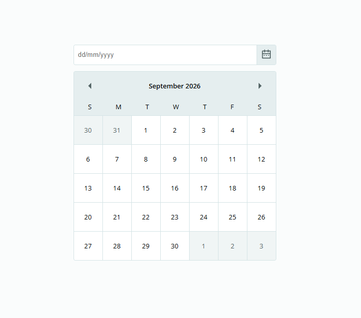

# Datepicker UI

A simple datepicker user interface built with **HTML and CSS** as part of the [roadmap.sh Datepicker UI challenge](https://roadmap.sh/projects/datepicker-ui).

The project focuses on recreating a clean and responsive datepicker component without implementing date selection functionality.

## 🛠️ Technologies

- HTML5
- CSS3

## Preview

## 🎯 Focus

- Calendar layout
- Form and input styling
- Responsive design
- CSS positioning and spacing
- Visual states for the datepicker

## 📚 Challenge

[Datepicker UI — roadmap.sh](https://roadmap.sh/projects/datepicker-ui)

## 📌 Status

**Completed**
